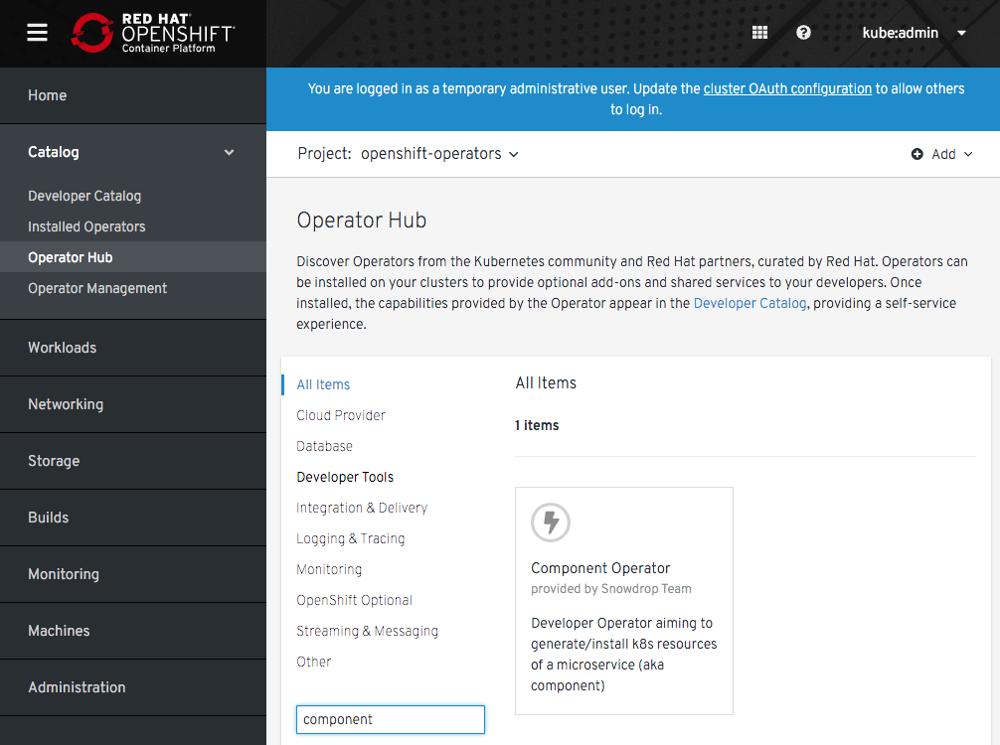
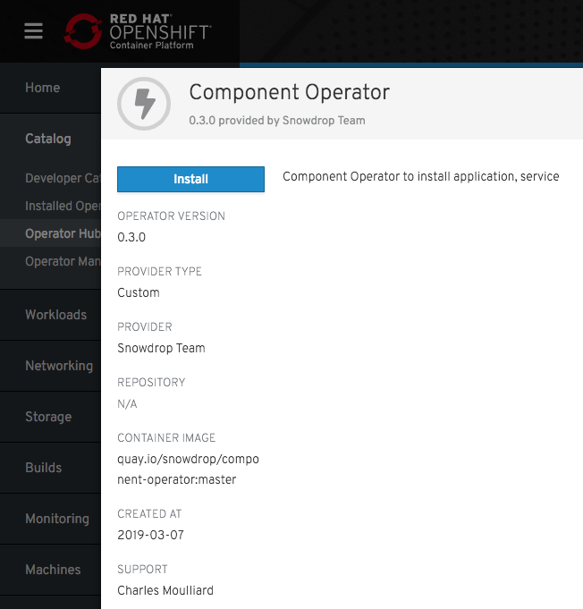
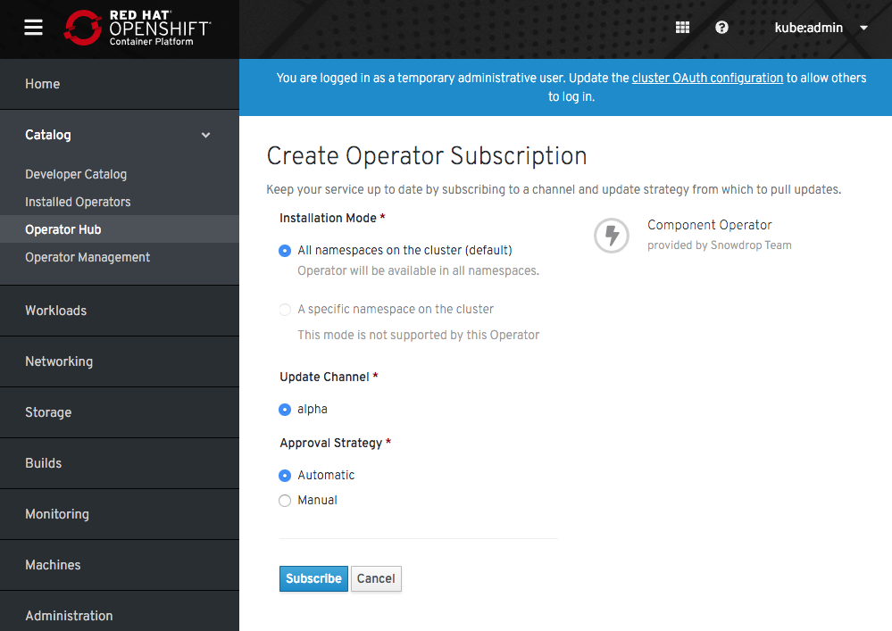
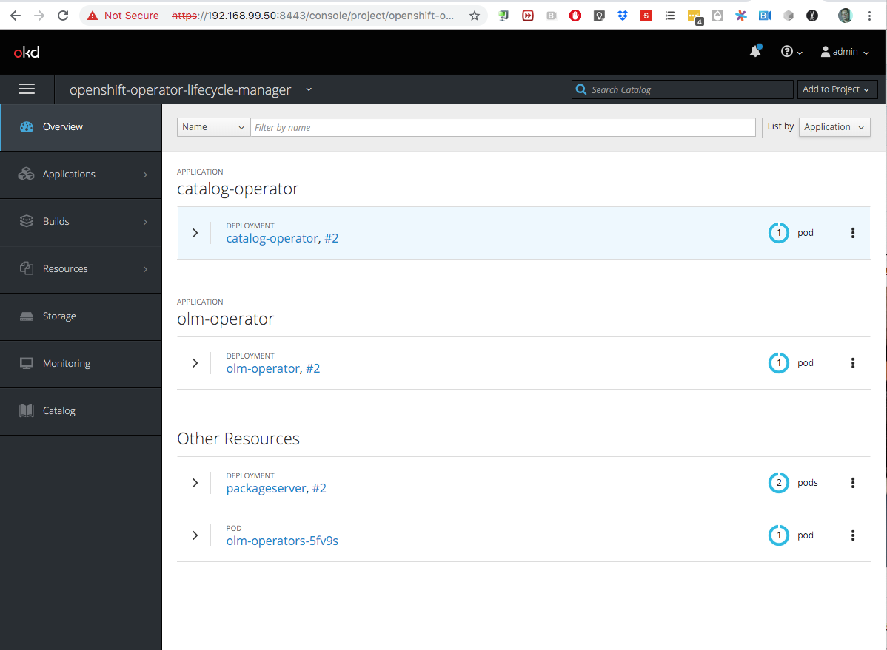
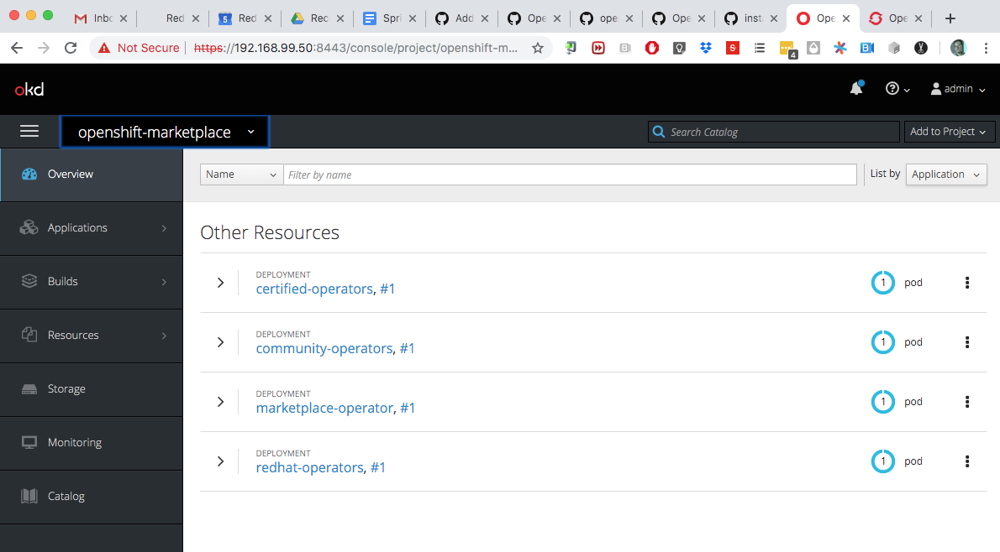
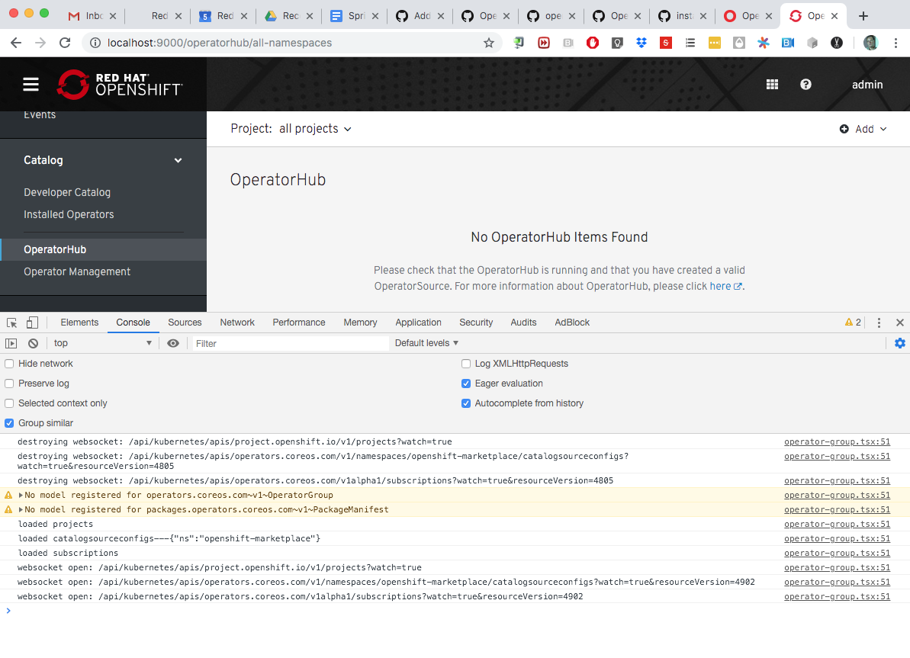

## Component's kubernetes operator

[](https://circleci.com/gh/snowdrop/component-operator/tree/master)

Table of Contents
=================

  * [For the users](#for-the-users)
    * [How to play with the Component operator locally](#how-to-play-with-the-component-operator-locally)
    * [A more complex scenario](#a-more-complex-scenario)
    * [Switch fromm inner to outer mode](#switch-fromm-inner-to-outer)
    * [How to install the operator on an cluster](#how-to-install-the-operator-on-the-cluster)
    * [Cleanup the operator](#cleanup)
  * [For the developers only](#for-the-developers-only)
      * [How To create the operator, crd](#how-to-create-the-operator-crd)
      * [How to deploy the Component Operator on OCP4 using the OperatorHub](#how-to-deploy-the-component-operator-on-ocp4-using-the-operatorhub)
         * [Package and install the Operator on Quay.io as Application](#package-and-install-the-operator-on-quayio-as-application)
         * [Deploy on OCP4](#deploy-on-ocp4)

## For the users

### How to play with the Component operator locally

- Log on to an OpenShift cluster >=3.10 with cluster-admin rights
- Create a namespace `component-operator`
  ```bash
  $ oc new-project component-operator
  ```

- Deploy the resources : service account, rbac and crd definition
  ```bash
  $ oc create -f deploy/sa.yaml
  $ oc create -f deploy/rbac.yaml
  $ oc create -f deploy/crds/crd.yaml
  ```

- Start the Operator locally using the `Main` go file
  ```bash
  $ oc new-project my-spring-app
  $ OPERATOR_NAME=component-operator WATCH_NAMESPACE=my-spring-app KUBERNETES_CONFIG=$HOME/.kube/config go run cmd/manager/main.go
  
- In a separate terminal create a component's yaml file with the following information
  ```bash
  echo "
  apiVersion: component.k8s.io/v1alpha1
  kind: Component
  metadata:
    name: my-spring-boot
  spec:
    runtime: spring-boot
    deploymentMode: innerloop" | oc apply -f -
  ```

- Check if the `operator` has created the following kubernetes resources, part of the `innerloop` deployment mode
  ```bash
  oc get all,pvc,component
  NAME                         READY     STATUS    RESTARTS   AGE
  pod/my-spring-boot-1-nrszv   1/1       Running   0          41s
  
  NAME                                     DESIRED   CURRENT   READY     AGE
  replicationcontroller/my-spring-boot-1   1         1         1         44s
  
  NAME                     TYPE        CLUSTER-IP    EXTERNAL-IP   PORT(S)    AGE
  service/my-spring-boot   ClusterIP   172.30.73.5   <none>        8080/TCP   45s
  
  NAME                                                REVISION   DESIRED   CURRENT   TRIGGERED BY
  deploymentconfig.apps.openshift.io/my-spring-boot   1          1         1         image(copy-supervisord:latest),image(dev-runtime-spring-boot:latest)
  
  NAME                                                     DOCKER REPO                                                     TAGS      UPDATED
  imagestream.image.openshift.io/copy-supervisord          docker-registry.default.svc:5000/demo/copy-supervisord          latest    45 seconds ago
  imagestream.image.openshift.io/dev-runtime-spring-boot   docker-registry.default.svc:5000/demo/dev-runtime-spring-boot   latest    45 seconds ago
  
  NAME                                        RUNTIME       VERSION   SERVICE   TYPE      CONSUMED BY   AGE
  component.component.k8s.io/my-spring-boot   spring-boot                                               46s
  
  NAME                                           STATUS    VOLUME    CAPACITY   ACCESS MODES   STORAGECLASS   AGE
  persistentvolumeclaim/m2-data-my-spring-boot   Bound     pv005     1Gi        RWO                           46s
  ```

- To cleanup the project installed (component)
  ```bash  
  $ oc delete components,route,svc,is,pvc,dc --all=true && 
  ``` 
  
### A more complex scenario   

In order to play with a more complex scenario where we would like to install 2 components: `frontend`, `backend` and a database's service from the Ansible Broker's catalog
like also the `links` needed to update the `DeploymentConfig`, then you should execute the following commands at the root of the github project within a terminal

  ```bash
  oc apply -f examples/demo/component-client.yml
  oc apply -f examples/demo/component-link-env.yml
  oc apply -f examples/demo/component-crud.yml
  oc apply -f examples/demo/component-service.yml
  oc apply -f examples/demo/component-link.yml
  ```  
  
### Switch from inner to outer

The existing operator supports to switch from the `inner` or development mode (where code must be pushed to the development's pod) to the `outer` mode (responsible to perform a `s2i` build 
deployment using a SCM project). In this case, a container image will be created from the project compiled and next a new deploymentConfig will be created in order to launch the 
runtime.

In order to switch, execute the following operations: 

- Decorate the `Component CRD yaml` file with the following values in order to specify the git info needed to perform a Build, like the name of the component to be selected to switch from
  the dev loop to the outer loop

  ```bash
   annotations:
     app.openshift.io/git-uri: https://github.com/snowdrop/component-operator-demo.git
     app.openshift.io/git-ref: master
     app.openshift.io/git-dir: fruit-backend-sb
     app.openshift.io/artifact-copy-args: "*.jar"
     app.openshift.io/runtime-image: "fruit-backend-sb"
     app.openshift.io/component-name: "fruit-backend-sb"
     app.openshift.io/java-app-jar: "fruit-backend-sb-0.0.1-SNAPSHOT.jar"
  ``` 
  
  **Remark** : When the maven project does not contain multi modules, then replace the name of the folder / module with `.` using the annotation `app.openshift.io/git-dir`
  
- Patch the component when it has been deployed to switch from the `inner` to the `outer` deployment mode
  
  ```bash
  oc patch cp fruit-backend-sb -p '{"spec":{"deploymentMode":"outerloop"}}' --type=merge
  ```   
  
### How to install the operator on a cluster

In the previous section, the operator was launched locally using a `go SDK`. If you would like to install it as a `container` on an OpenShift cluster, then it is required to build 
the container image using the `operator-sdk` tool [1], to push the image and next to install the operator using a `Deployment` kubernetes resource as defined hereafter

  ```bash
  operator-sdk build quay.io/snowdrop/component-operator
  docker push quay.io/snowdrop/component-operator
  oc create -f deploy/operator.yaml
  ``` 
  
[1] https://github.com/operator-framework/operator-sdk   

### Cleanup

  ```bash
  oc delete -f deploy/cr.yaml
  oc delete -f deploy/crds/crd.yaml
  oc delete -f deploy/operator.yaml
  oc delete -f deploy/rbac.yaml
  oc delete -f deploy/sa.yaml
  ```   
  
## For the developers only
  
### How To create the operator, crd

Instructions followed to create the Component's CRD, operator using the `operator-sdk`'s kit

- Execute this command within the `$GOPATH/github.com/$ORG/` folder is a terminal
  ```bash
  operator-sdk new component-operator --api-version=component.k8s.io/v1alpha1 --kind=Component --skip-git-init
  operator-sdk add api --api-version=component.k8s.io/v1alpha1 --kind=Component 
  ```
  using the following parameters 

  Name of the folder to be created : `component-operator`
  Api Group Name   : `component.k8s.io`
  Api Version      : `v1alpha1`
  Kind of Resource : `Component` 

- Build and push the `component-operator` image to `quai.io`s registry
  ```bash
  $ operator-sdk build quay.io/snowdrop/component-operator
  $ docker push quay.io/snowdrop/component-operator
  ```
  
- Update the operator's manifest to use the built image name
  ```bash
  sed -i 's|REPLACE_IMAGE|quay.io/snowdrop/component-operator|g' deploy/operator.yaml
  ```
- Create a namespace `component-operator`

- Deploy the component-operator
  ```bash
  oc new-project component-operator
  oc create -f deploy/sa.yaml
  oc create -f deploy/cluster-rbac.yaml
  oc create -f deploy/crds/crd.yaml
  oc create -f deploy/operator.yaml
  ```

- By default, creating a custom resource triggers the `component-operator` to deploy a busybox pod
  ```bash
  oc create -f deploy/component/cr.yaml
  ```

- Verify that the busybox pod is created
  ```bash
  oc get pod -l app=busy-box
  NAME            READY     STATUS    RESTARTS   AGE
  busy-box   1/1       Running   0          50s
  ```

- Cleanup
  ```bash
  oc delete -f deploy/cr.yaml
  oc delete -f deploy/crds/crd.yaml
  oc delete -f deploy/operator.yaml
  oc delete -f deploy/cluster-rbac.yaml
  oc delete -f deploy/sa.yaml
  ```

- Start operator locally

  ```bash
  $ oc new-project my-spring-app
  $ OPERATOR_NAME=component-operator WATCH_NAMESPACE=my-spring-app KUBERNETES_CONFIG=/Users/dabou/.kube/config go run cmd/manager/main.go
  
  $ oc delete components,route,svc,is,pvc,dc --all=true && go run cmd/sd/sd.go create my-spring-boot
  OR
  $ oc apply -f deploy/component1.yml
  $ oc get all,pvc,components,dc
  
  oc delete components,route,svc,is,pvc,dc --all=true
  ```  

### How to deploy the Component Operator on OCP4 using the OperatorHub

#### Package and install the Operator on Quay.io as an Application

Install the [tool](https://github.com/operator-framework/operator-courier) `operator-courier`.

    pip3 install operator-courier
    
Verify your operator's bundle using the tool.

    export BUNDLE_DIR="deploy/olm-catalog/bundle"
    operator-courier verify $BUNDLE_DIR
    WARNING:operatorcourier.validate:csv spec.icon not defined    

Next, get from `quay.io` an Authentication token using your quay's username OR robot username/pwd to access your namespace.

Next, execute the following `curl` request to get a token (e.g `basic Y2gwMDdtK...A="`).

    export QUAY_USER="QUAY USER"
    export QUAY_PWD="QUAY PASSWORD"    
    export AUTH_TOKEN=$(curl -X POST -H "Content-Type: application/json" -d '{"user":{"username":"'"$QUAY_USER"'","password":"'"$QUAY_PWD"'"}}' https://quay.io/cnr/api/v1/users/login | jq -r '.token')
    
Push finally the bundle on quay as an `application`.

    export QUAY_ORG="quay_organization (e.g ch007m)"
    export REPOSITORY="component"
    export RELEASE="0.5.0"
    operator-courier push $BUNDLE_DIR $QUAY_ORG $REPOSITORY $RELEASE "$AUTH_TOKEN"
    
#### Deploy on OCP4

Log on to an ocp4 cluster as a cluster-admin role user.

Deploy the `OperatorSource` in order to install from `Quay.io/app` the bundle of the operator.

    oc apply -f deploy/olm-catalog/operator-source-redhat.yaml -n openshift-marketplace  

Next, subscribe to the `operator` by clicking on the button `install` of the `Component operatror` that you can select from the screen
`operatorhub`.





Wait a few moment and check if the pod of the operator has been created under the `openshift-operators` namespace.

    oc get -n openshift-operators pods
    NAME                                  READY     STATUS    RESTARTS   AGE
    component-operator-85fcbdf6fc-r4fmf   1/1       Running   0          9m
    
To clean-up , execute the following commands

    oc delete -n openshift-operators subscriptions/component
    oc delete -n openshift-marketplace operatorsource/component-operator
    oc delete crd/components.component.k8s.io
    oc delete -n openshift-operators ClusterServiceVersion/component-operator.v0.5.0
    oc delete -n openshift-marketplace CatalogSourceConfig/installed-custom-openshift-operators 
    oc delete -n openshift-operators deployment/component-operator

### How to install the Operator using OLM, Marketplace on ocp/okd 3.x

#### Step 1 - Install the new OpenShift console

- Launch an ocp/okd 3.11 cluster locally
- Log on with a user having the `cluster-admin` role
- Git clone the new OpenShift console (created for ocp4) and build it
```
git clone https://github.com/openshift/console.git && cd console
./build.sh
```

- Launch the proxy console locally 

```
source ./contrib/oc-environment.sh
./bin/bridge
```

#### Step 2 - Install the OLM and Marketplace 

From another terminal, install the *Operator Lifecycle Manager* using this command:
```bash
oc apply -f https://raw.githubusercontent.com/operator-framework/operator-lifecycle-manager/master/deploy/upstream/manifests/0.8.1/0000_50_olm_00-namespace.yaml
oc apply -f https://raw.githubusercontent.com/operator-framework/operator-lifecycle-manager/master/deploy/upstream/manifests/0.8.1/0000_50_olm_00-namespace.yaml
oc apply -f https://raw.githubusercontent.com/operator-framework/operator-lifecycle-manager/master/deploy/upstream/manifests/0.8.1/0000_50_olm_01-olm-operator.serviceaccount.yaml
oc apply -f https://raw.githubusercontent.com/operator-framework/operator-lifecycle-manager/master/deploy/upstream/manifests/0.8.1/0000_50_olm_02-clusterserviceversion.crd.yaml
oc apply -f https://raw.githubusercontent.com/operator-framework/operator-lifecycle-manager/master/deploy/upstream/manifests/0.8.1/0000_50_olm_03-installplan.crd.yaml
oc apply -f https://raw.githubusercontent.com/operator-framework/operator-lifecycle-manager/master/deploy/upstream/manifests/0.8.1/0000_50_olm_04-subscription.crd.yaml
oc apply -f https://raw.githubusercontent.com/operator-framework/operator-lifecycle-manager/master/deploy/upstream/manifests/0.8.1/0000_50_olm_05-catalogsource.crd.yaml
oc apply -f https://raw.githubusercontent.com/operator-framework/operator-lifecycle-manager/master/deploy/upstream/manifests/0.8.1/0000_50_olm_06-olm-operator.deployment.yaml
oc apply -f https://raw.githubusercontent.com/operator-framework/operator-lifecycle-manager/master/deploy/upstream/manifests/0.8.1/0000_50_olm_07-catalog-operator.deployment.yaml
oc apply -f https://raw.githubusercontent.com/operator-framework/operator-lifecycle-manager/master/deploy/upstream/manifests/0.8.1/0000_50_olm_08-aggregated.clusterrole.yaml
oc apply -f https://raw.githubusercontent.com/operator-framework/operator-lifecycle-manager/master/deploy/upstream/manifests/0.8.1/0000_50_olm_09-operatorgroup.crd.yaml
oc apply -f https://raw.githubusercontent.com/operator-framework/operator-lifecycle-manager/master/deploy/upstream/manifests/0.8.1/0000_50_olm_10-olm-operators.configmap.yaml
oc apply -f https://raw.githubusercontent.com/operator-framework/operator-lifecycle-manager/master/deploy/upstream/manifests/0.8.1/0000_50_olm_11-olm-operators.catalogsource.yaml
oc apply -f https://raw.githubusercontent.com/operator-framework/operator-lifecycle-manager/master/deploy/upstream/manifests/0.8.1/0000_50_olm_12-operatorgroup-default.yaml
oc apply -f https://raw.githubusercontent.com/operator-framework/operator-lifecycle-manager/master/deploy/upstream/manifests/0.8.1/0000_50_olm_13-packageserver.subscription.yaml
oc apply -f https://raw.githubusercontent.com/operator-framework/operator-lifecycle-manager/master/deploy/upstream/manifests/0.8.1/0000_50_olm_17-upstream-operators.catalogsource.yaml
```

**Remark** the following command fails `oc create -f https://raw.githubusercontent.com/operator-framework/operator-lifecycle-manager/master/deploy/upstream/quickstart/olm.yaml` as some resources can't be installed
. This is the reason why all the resources are installed individually.

When installed, deploy the marketplace resources responsible to manage the different operators under an `Operatorhub`.
```bash
echo "Install marketplace"
oc create -f https://raw.githubusercontent.com/operator-framework/operator-marketplace/master/deploy/upstream/01_namespace.yaml
oc create -f https://raw.githubusercontent.com/operator-framework/operator-marketplace/master/deploy/upstream/02_catalogsourceconfig.crd.yaml
oc create -f https://raw.githubusercontent.com/operator-framework/operator-marketplace/master/deploy/upstream/03_operatorsource.crd.yaml
oc create -f https://raw.githubusercontent.com/operator-framework/operator-marketplace/master/deploy/upstream/04_service_account.yaml
oc create -f https://raw.githubusercontent.com/operator-framework/operator-marketplace/master/deploy/upstream/05_role.yaml
oc create -f https://raw.githubusercontent.com/operator-framework/operator-marketplace/master/deploy/upstream/06_role_binding.yaml
oc create -f https://raw.githubusercontent.com/operator-framework/operator-marketplace/master/deploy/upstream/07_operator.yaml
oc create -f https://raw.githubusercontent.com/operator-framework/operator-marketplace/master/deploy/examples/upstream.operatorsource.cr.yaml -n marketplace
```

Install our `Component Operator` now
```bash
oc create -f deploy/olm-catalog/component-operator-source.yaml -n marketplace
```

After a few moment, check if the `OperatorSource` have been deployed successfully
```bash
oc get opsrc upstream-community-operators -o=custom-columns=NAME:.metadata.name,PACKAGES:.status.packages -n marketplace
NAME                           PACKAGES
upstream-community-operators   jaeger,prometheus,aws-service,etcd,mongodb-enterprise,redis-enterprise,federation,planetscale,strimzi-kafka-operator,cockroachdb,microcks,vault,percona,couchbase-enterprise,postgresql,oneagent

oc get opsrc component-operator -n marketplace
NAME                 TYPE          ENDPOINT              REGISTRY   DISPLAYNAME          PUBLISHER   STATUS      MESSAGE                                       AGE
component-operator   appregistry   https://quay.io/cnr   ch007m     Component Operator   Snowdrop    Succeeded   The object has been successfully reconciled   35s
```

Create a CatalogSourceConfig and a Subscription to install the `Component operator` within the `operators` namespace
```bash
oc create -f deploy/olm-catalog/component-subscription.yaml -n operators
```

Verify if the Component Operator is up and running 
```bash
oc logs -n operators pod/component-operator-59cf6cf54-xk8mx
2019/04/04 16:26:58 Go Version: go1.11.6
2019/04/04 16:26:58 Go OS/Arch: linux/amd64
2019/04/04 16:26:58 component-operator version: unset
2019/04/04 16:26:58 component-operator git commit: b695ee1
2019/04/04 16:26:58 Registering Components
2019/04/04 16:26:58 Start the manager
```

#### Deploy on okd 3.11 using Openshift resources

Create an `oc cluster up` 3.11  and add `cluster-admin` role to the `admin` user

Install olm using the resources of the olm project created under the folder deploy/okd/manifests/latest

```bash
oc apply -f deploy/olm-catalog/olm/0000_50_olm_00-namespace.yaml
oc apply -f deploy/olm-catalog/olm/0000_50_olm_01-olm-operator.serviceaccount.yaml
oc apply -f deploy/olm-catalog/olm/0000_50_olm_02-clusterserviceversion.crd.yaml
oc apply -f deploy/olm-catalog/olm/0000_50_olm_03-installplan.crd.yaml
oc apply -f deploy/olm-catalog/olm/0000_50_olm_04-subscription.crd.yaml
oc apply -f deploy/olm-catalog/olm/0000_50_olm_05-catalogsource.crd.yaml
oc apply -f deploy/olm-catalog/olm/0000_50_olm_06-olm-operator.deployment.yaml
oc apply -f deploy/olm-catalog/olm/0000_50_olm_07-catalog-operator.deployment.yaml
oc apply -f deploy/olm-catalog/olm/0000_50_olm_08-aggregated.clusterrole.yaml
oc apply -f deploy/olm-catalog/olm/0000_50_olm_09-operatorgroup.crd.yaml
oc apply -f deploy/olm-catalog/olm/0000_50_olm_10-olm-operators.configmap.yaml
oc apply -f deploy/olm-catalog/olm/0000_50_olm_11-olm-operators.catalogsource.yaml
oc apply -f deploy/olm-catalog/olm/0000_50_olm_12-operatorgroup-default.yaml
oc apply -f deploy/olm-catalog/olm/0000_50_olm_13-packageserver.subscription.yaml



Install Openshift Marketplace using the resources of the `Marketplace` project located under the folder manifests without the resources `11_clusteroperator.yaml`, `image-references` 
and where the `node_selector` has been removed from the `10_operator.yaml` file 

```bash
oc create -f deploy/olm-catalog/marketplace/01_namespace.yaml
oc create -f deploy/olm-catalog/marketplace/02_catalogsourceconfig.crd.yaml
oc create -f deploy/olm-catalog/marketplace/03_operatorsource.crd.yaml
oc create -f deploy/olm-catalog/marketplace/04_service_account.yaml
oc create -f deploy/olm-catalog/marketplace/05_role.yaml
oc create -f deploy/olm-catalog/marketplace/06_role_binding.yaml
oc create -f deploy/olm-catalog/marketplace/07_redhat_operatorsource.cr.yaml
oc create -f deploy/olm-catalog/marketplace/08_certified_operatorsource.cr.yaml
oc create -f deploy/olm-catalog/marketplace/09_community_operatorsource.cr.yaml
oc create -f deploy/olm-catalog/marketplace/10_operator.yaml
```


Check if the operators appear under the `Operatorhub` screen



Install the component operator bundle
```bash
oc create -f deploy/olm-catalog/component-operator-source.yaml -n openshift-marketplace
```

Create a subscription for the component operator
```bash
oc create -f deploy/olm-catalog/component-subscription-ocp4.yaml -n openshift-operators
```

oc get opsrc --all-namespaces 
NAMESPACE               NAME                  TYPE          ENDPOINT              REGISTRY              DISPLAYNAME           PUBLISHER   STATUS      MESSAGE                                       AGE
openshift-marketplace   certified-operators   appregistry   https://quay.io/cnr   certified-operators   Certified Operators   Red Hat     Succeeded   The object has been successfully reconciled   5m
openshift-marketplace   community-operators   appregistry   https://quay.io/cnr   community-operators   Community Operators   Red Hat     Succeeded   The object has been successfully reconciled   5m
openshift-marketplace   component-operator    appregistry   https://quay.io/cnr   ch007m                Component Operator    Snowdrop    Succeeded   The object has been successfully reconciled   1m
openshift-marketplace   redhat-operators      appregistry   https://quay.io/cnr   redhat-operators      Red Hat Operators     Red Hat     Succeeded   The object has been successfully reconciled   5m
```

#### Cleanup

```bash
oc delete -f https://raw.githubusercontent.com/operator-framework/operator-marketplace/master/deploy/upstream/02_catalogsourceconfig.crd.yaml
oc delete -f https://raw.githubusercontent.com/operator-framework/operator-marketplace/master/deploy/upstream/03_operatorsource.crd.yaml
oc delete -f https://raw.githubusercontent.com/operator-framework/operator-marketplace/master/deploy/upstream/04_service_account.yaml
oc delete -f https://raw.githubusercontent.com/operator-framework/operator-marketplace/master/deploy/upstream/05_role.yaml
oc delete -f https://raw.githubusercontent.com/operator-framework/operator-marketplace/master/deploy/upstream/06_role_binding.yaml
oc delete -f https://raw.githubusercontent.com/operator-framework/operator-marketplace/master/deploy/upstream/07_operator.yaml

oc delete -f https://raw.githubusercontent.com/operator-framework/operator-marketplace/master/deploy/examples/upstream.operatorsource.cr.yaml

oc delete -f https://raw.githubusercontent.com/operator-framework/operator-marketplace/master/deploy/upstream/01_namespace.yaml

oc delete -f https://raw.githubusercontent.com/operator-framework/operator-lifecycle-manager/master/deploy/upstream/quickstart/olm.yaml 
```