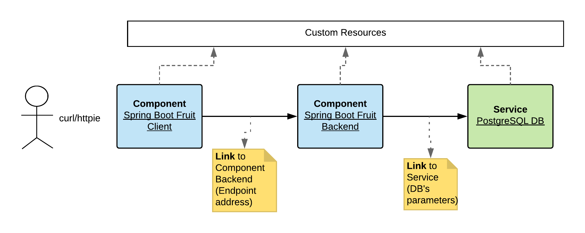

# A Real Example

  * [Introduction](#introduction)
  * [Demo's time](#demos-time)
     * [Build the application](#build-the-application)
     * [Install the components on the cluster](#install-the-components-on-the-cluster)
     * [Check if the Component Client is replying](#check-if-the-component-client-is-replying)
     * [Using K8s](#using-k8s)
     * [Switch from Dev to Build mode](#switch-from-dev-to-build-mode)
     * [Nodejs deployment](#nodejs-deployment)
     * [Scaffold a project](#scaffold-a-project)
  * [Cleanup](#cleanup)


## Introduction

The purpose of this demo is to showcase how you can use the `Component`, `Link` and `Capability` CRs combined with the Kubernetes `operator` to help you to :
- Install your Microservices - Spring Boot applications,
- Instantiate a PostgreSQL database
- Inject the required information to the different Microservices to let a Spring Boot application to access a service which is a http endpoint or to consume a database

The real example consists, as depicted within the following diagram, of two Spring Boot applications and a PostgreSQL Database.



The application to be deployed can be described using a Fluent DSL syntax as :

`(from:componentA).(to:componentB).(to:serviceA)`

where the `ComponentA` and `ComponentB` correspond respectively to a Spring Boot application `fruit-client-sb` and `fruit-backend-sb`.

The relation `from -> to` indicates that we will `reference` the `ComponentA`  with the `ComponentB` using a `Link`.

The `link`'s purpose is to inject as `Env var(s)` the information required to by example configure the `HTTP client` of the `ComponentA` to access the 
`ComponentB` which exposes a `HTTP endpoint` that the client `ComponentA`  could use to access the `CRUD` operations.

To let the `ComponentB` to consume a database, we will also setup a `link` in order to pass using the database `Secret` the parameters which are needed to configure a Java Datasource's bean.

To avoid that you must manually generate such `CR`, we will use the project [`Dekorate`](https://dekorate.io) which supports to generate Kubernetes resources from Java Annotations or using parameters defined
within an `application.properties` file. 

## Demo's time

### Build the application

- Build the `frontend` and the `Backend` using `mvn` to generate their respective Spring Boot uber jar file
```bash
mvn clean package
``` 

### Install the components on the cluster

As our Spring Boot applications use the `ap4k` dependencies, then during the `mvn compile or mvn package` phases, additional yaml resources will be created under the 
directory `ap4k`. They will be next used to deploy the different components on the cluster with the help of the `oc` or `kubectl` client tool.

```bash
<maven_project>/target/classes/META-INF/ap4k/
```

Here is what we did within the Java classes of the frontend ot backend applications in order to tell to Ap4k to generate either a `Component`, `Link` or 
`Capability` Custom Resource definition (yaml|json).

The `@CompositeApplication` is used by the `ap4k` lib to generate a `Component CRD` resource, containing
the definition of the runtime, the name of the component, if a route is needed.
  
A `@Link` represents additional information or metadata to be injected within the `Comnponent` (aka Deployment resource)
in order to configure the application to access another `component` using its service address, a service deployed from the k8s catalog.
 
**client**
```java
@CompositeApplication(
        name = "fruit-client-sb",
        exposeService = true,
        links = @Link(
                  name = "Env var to be injected within the target component -> fruit-backend",
                  targetcomponentname = "fruit-client-sb",
                  kind = "Env",
                  ref = "",
                  envVars = @Env(
                          name  = "ENDPOINT_BACKEND",
                          value = "http://fruit-backend-sb:8080/api/fruits"
                  )
))
```
  
To express the creation of a Service/Capability on the Cloud platform, we are using the `@ServiceCatalog` annotation where we define the `Service's class`, its plan and parameters
as defined by the Database PostgreSQL Service of the OpenDhift Ansible Broker.

Like for the Client's component, we will also define a `@Link` annotation to inject from the secret created during the creation of the service, the parameters that the application
will use to configure, in this example, the `DataSource`'s object able to call the `PostgreSQL` instance.

**Backend**
```java
@CompositeApplication(
        name = "fruit-backend-sb",
        exposeService = true,
        envVars = @Env(
                name = "SPRING_PROFILES_ACTIVE",
                value = "broker-catalog"),
        links = @Link(
                name = "Secret to be injected as EnvVar using Service's secret",
                targetcomponentname = "fruit-backend-sb",
                kind = "Secret",
                ref = "postgresql-db"))
@ServiceCatalog(
   instances = @ServiceCatalogInstance(
        name = "postgresql-db",
        serviceClass = "dh-postgresql-apb",
        servicePlan = "dev",
        bindingSecret = "postgresql-db",
        parameters = {
                @Parameter(key = "postgresql_user", value = "luke"),
                @Parameter(key = "postgresql_password", value = "secret"),
                @Parameter(key = "postgresql_database", value = "my_data"),
                @Parameter(key = "postgresql_version", value = "9.6")
        }
   )
) 
```  

Deploy the generated `component.yml` resource files
```bash
oc apply -f fruit-client-sb/target/classes/META-INF/ap4k/component.yml
oc apply -f fruit-backend-sb/target/classes/META-INF/ap4k/component.yml
``` 

when the Supervisord pod is ready, then push the code and launch the java application using the following bash script
```bash
./scripts/push_start.sh fruit-client sb
./scripts/push_start.sh fruit-backend sb
```

### Check if the Component Client is replying

- Call the HTTP Endpoint exposed by the `Spring Boot Fruit Client` in order to fetch data from the database
```bash
route_address=$(oc get route/fruit-client-sb -o jsonpath='{.spec.host}')
curl http://$route_address/api/client
or 

using httpie client
http -s solarized http://$route_address/api/client
http -s solarized http://$route_address/api/client/1
http -s solarized http://$route_address/api/client/2
http -s solarized http://$route_address/api/client/3
``` 

### Using K8s

Before to install the operator, create a kubernetes namespace and then deploy the resources
as defined within the section of the README - Minikube

Next, install the 2 components `frontend` and `backend` within the namespace demo

```bash
kubectl create namespace demo
kubectl apply -n demo -f fruit-backend-sb/target/classes/META-INF/ap4k/component.yml
kubectl apply -n demo -f fruit-client-sb/target/classes/META-INF/ap4k/component.yml
```

When the Dev's pods are ready, then push the code using the following bash script within the target namespace

```bash
./scripts/k8s_push_start.sh fruit-backend sb demo
./scripts/k8s_push_start.sh fruit-client sb demo
```

**REMARK**: the namespace where the application will be deployed must be passed as 3rd paramter to the bash script

As an Ingress route will be created instead of an OpenShift route, then we must adapt the curl command to access the service's address
and get the fruits

```bash
# export FRONTEND_ROUTE_URL=<service_name>.<hostname_or_ip>.<domain_name>
export FRONTEND_ROUTE_URL=fruit-client-sb.10.0.76.186.nip.io
curl -H "Host: fruit-client-sb" ${FRONTEND_ROUTE_URL}/api/client
```

### Switch from Dev to Build mode

- Decorate the Component with the following values in order to specify the git info needed to perform a Build, like the name of the component to be selected to switch from
  the dev loop to the publish loop

  ```bash
   annotations:
     app.openshift.io/git-uri: https://github.com/snowdrop/component-operator-demo.git
     app.openshift.io/git-ref: master
     app.openshift.io/git-dir: fruit-backend-sb
     app.openshift.io/artifact-copy-args: "*.jar"
     app.openshift.io/runtime-image: "fruit-backend-sb"
     app.openshift.io/component-name: "fruit-backend-sb"
     app.openshift.io/java-app-jar: "fruit-backend-sb-0.0.1-SNAPSHOT.jar"
  ``` 
  
  **Remark** : When the maven project does not contain multi modules, then replace the name of the folder / module with `.` using the annotation `app.openshift.io/git-dir`
  
- Patch the component when it has been deployed to switch from `dev` to `build`
  
  ```bash
  oc patch cp fruit-backend-sb -p '{"spec":{"deploymentMode":"build"}}' --type=merge
  ```   

### Nodejs deployment

- Build node project locally
```bash
cd fruit-client-nodejs
nvm use v10.1.0
npm audit fix
npm install -s --only=production
```

- Run locally
```bash
export ENDPOINT_BACKEND=http://fruit-backend-sb.my-spring-app.195.201.87.126.nip.io/api/fruits
npm run -d start      
```

- Deploy the node's component and link it to the Spring Boot fruit backend
```bash
oc apply -f fruit-client-nodejs/component.yml
oc apply -f fruit-client-nodejs/env-backend-endpoint.yml
```

- Push the code and start the nodejs application
```bash
./scripts/push_start.sh fruit-client nodejs
```

- Test it locally or remotely
```bash
# locally
http :8080/api/client
http :8080/api/client/1 

#Remotely
route_address=$(oc get route/fruit-client-nodejs -o jsonpath='{.spec.host}')
curl http://$route_address/api/client
or 

using httpie client
http http://$route_address/api/client
http http://$route_address/api/client/1
http http://$route_address/api/client/2
http http://$route_address/api/client/3
```

### Scaffold a project


```bash
git clone git@github.com:snowdrop/scaffold-command.git && cd scaffold-command
go build -o scaffold cmd/scaffold.go
export PATH=$PATH:/Users/dabou/Code/snowdrop/scaffold-command

 scaffold   
? Create from template Yes
? Available templates rest
? Group Id me.snowdrop
? Artifact Id myproject
? Version 1.0.0-SNAPSHOT
? Package name me.snowdrop.myproject
? Spring Boot version 2.1.2.RELEASE
? Use supported version No
? Where should we create your new project ./fruit-demo

cd demo

add to the pom.xml file

<properties>
  ...
  <dekorate.version>0.3.2</dekorate.version>
</properties>
  
and 

<dependencies>
  <dependency>
    <groupId>io.dekorate</groupId>
    <artifactId>component-annotations</artifactId>
    <version>${dekorate.version}</version>
  </dependency>
  <dependency>
    <groupId>io.dekorate</groupId>
    <artifactId>kubernetes-annotations</artifactId>
    <version>${dekorate.version}</version>
  </dependency>
  <dependency>
    <groupId>io.dekorate</groupId>
    <artifactId>dekorate-spring-boot</artifactId>
    <version>${dekorate.version}</version>
  </dependency>
  <!-- spring Boot -->
```

## Cleanup

TODO: To be updated as this is not longer correct

